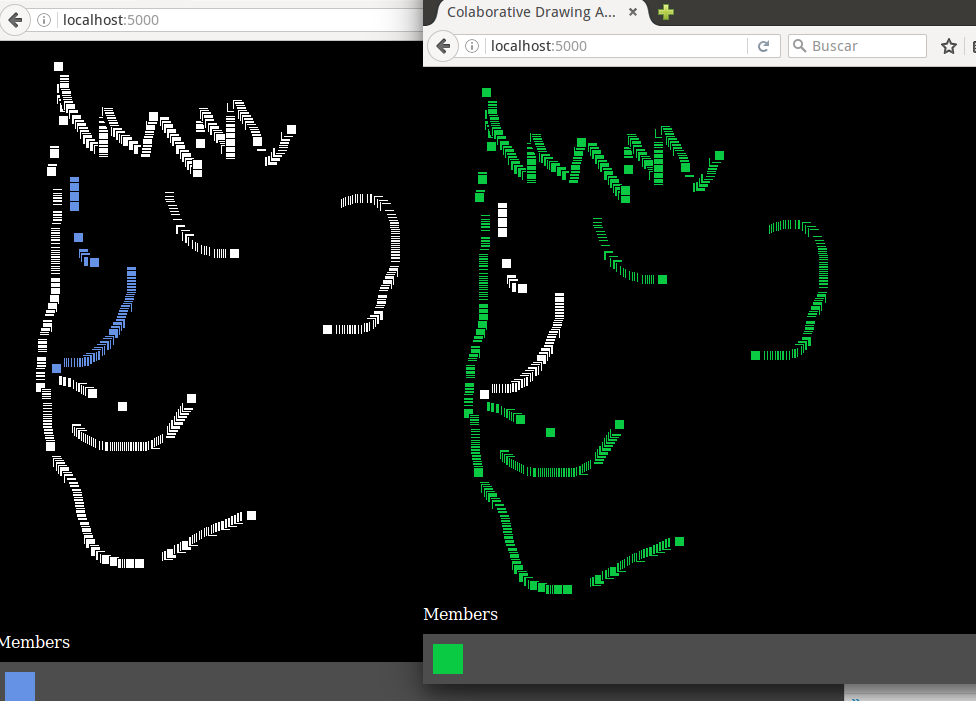

# Realtime drawing canvas

This is a realtime drawing canvas that uses Socket.io, Expresss, p5.js and Node.js.

## What is p5.js?

p5.js is a great library for interacting with the html5 canvas, audio, and many other.
Check their webpage at [http://p5js.org](http://p5js.org)

## Features

- Presence events
- Disconnection events
- Members list (bottom of the page)

## Requirements
- Node.js

## Running
1. Open index.html as a webpage

Then, open as many other browser tabs you want, and check functionality.